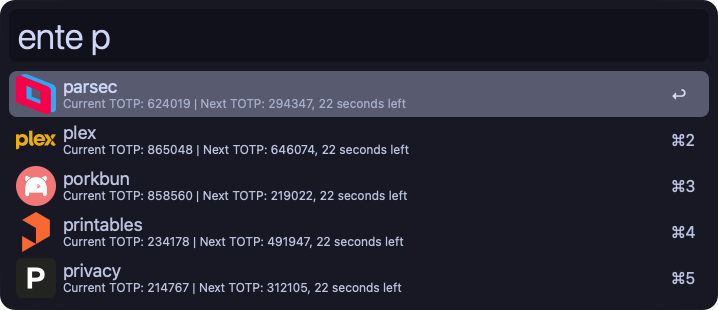

# Ente Auth - Alfred Workflow for Ente Exports

Easily integrate your **Ente Auth** with Alfred using this simple workflow to query your Ente Auth TOTP accounts.

The workflow uses Ente CLI to export your secrets from Ente Auth and then stashes them securely into the macOS Keychain.

## 📸 Shots


## 🚀 Setup

> [!NOTE]
> Currently, Homebrew installation is not available for the Ente CLI. A formula will be added pending a new release including a [required fix](https://github.com/ente-io/ente/pull/4028). For the time being, please use the manual installation steps outlined below.

### 1. Download and Install the Ente CLI

To use the **Ente Auth** workflow, you'll need the **Ente CLI**. Follow the steps below to install it:

1. Visit the [Ente CLI releases page](https://github.com/ente-io/ente/releases?q=tag%3Acli-v0).
2. Download the latest version for **macOS**.
3. Move the binary to `/usr/local/bin` and make it executable with the following commands:

   ```bash
   sudo mv /path/to/ente /usr/local/bin/ente
   sudo chmod +x /usr/local/bin/ente
   ```

Once installed, verify that it's working by running the following command in your terminal:

```bash
ente version
```

### 2. Configure Ente CLI

- Run `ente account add` to authenticate yourself with Ente CLI.
- You'll first be prompted for the app type. Enter `auth`.
- Next, you'll be asked for an export directory. You can choose any path you wish, but it must exist before you press return, else Ente CLI will not accept it.
- Finally, you'll be prompted to provide your Ente login credentials.

### 3. Install the Workflow

Download and open the workflow file from the [latest release](https://github.com/chkpwd/alfred-ente-auth/releases/latest) page.

> [!NOTE]
> To ensure the workflow can import your accounts from Ente Auth, you'll need to define the "Ente Export Directory" when you add this extension to Alfred.  
> This path should be the same one you configured when adding your Ente account.  
> To show the Ente CLI's configured export path, run `ente account list` and refer to the `ExportDir` value.

---

## 📖 Usage Instructions

1. **Launch Alfred**

2. **Import Your Data**
   - To import your Ente Auth TOTP accounts, simply trigger the workflow by running **`ente import`** in Alfred.

3. **Search for an Ente Auth TOTP account**
   - To list all of your Ente Auth TOTP accounts, run `ente` in Alfred.
   - To search for a specific account, simply append a search string to the previous command.
     Example: `ente GitHub`
   - The search feature also supports loose search queries, matching words in the account name in any order.
      - For example "Docker Hub" will match with the queries "Docker Hub", "Hub", "Do Hu".

---

## 🛠 Local Development

### Install/Update Dependencies
To set up your local environment, run the following command to install or update the necessary dependencies:

```bash
poetry install --only=main
```

### Build the Alfred Workflow File
Once your environment is ready, use this command to build the workflow file:

```bash
python3 build.py
```

---

## Making it Better 🤝

Feel free to open issues or submit pull requests.
